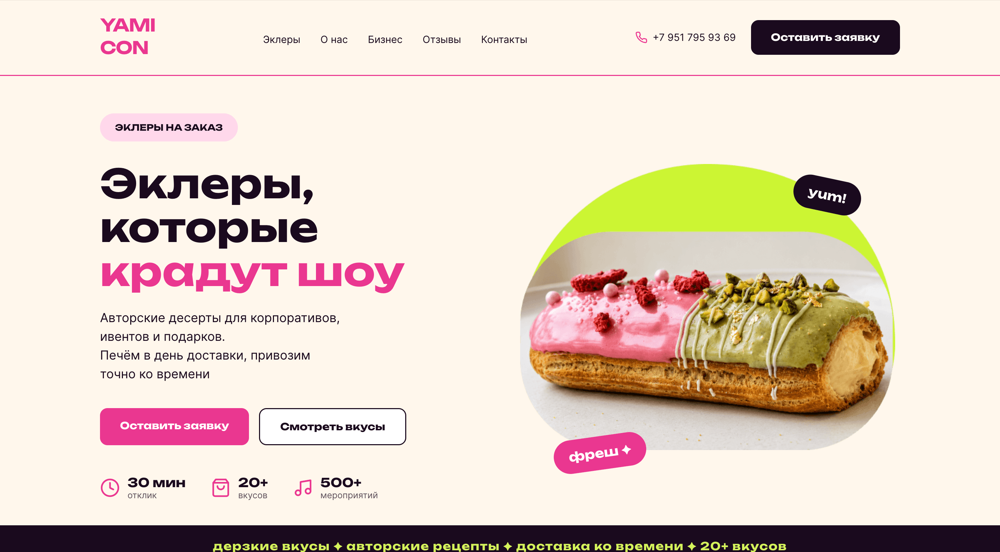
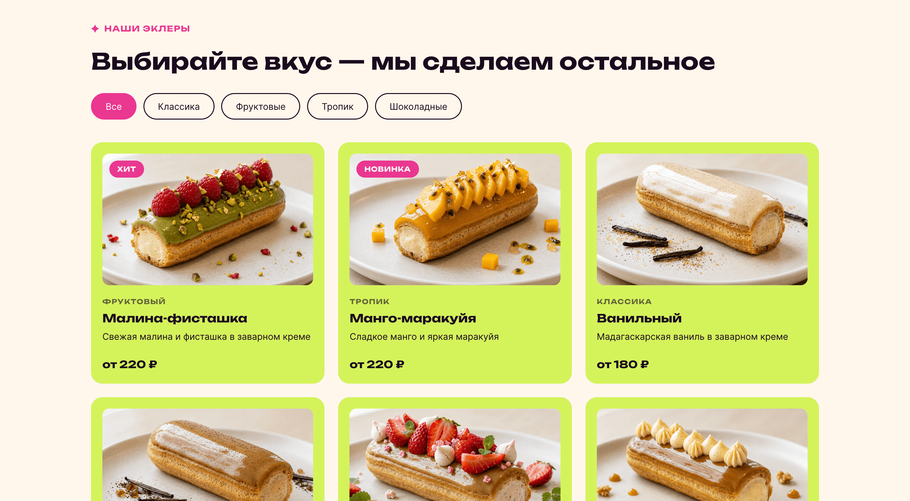
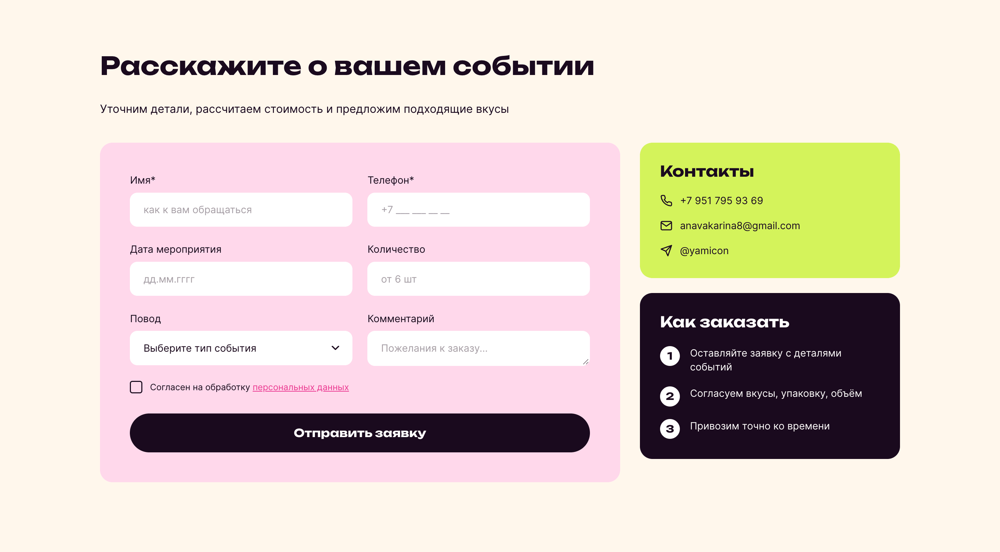

# 🍰 YAMICON — Лендинг для кондитерской эклеров

Фриланс-проект
Авторский лендинг для бренда авторских эклеров с интерактивными элементами и формой заказа.

**🔗 [Посмотреть демо](https://anavakarina.github.io/yamicon-landing/)**

## 📸 Скриншоты




                    


            

## 🎯 О проекте

Лендинг для кондитерской YAMICON, специализирующейся на авторских эклерах для мероприятий и корпоративных заказов.

### Что реализовано:
- ✅ Полностью адаптивный дизайн (от 320px до 1920px)
- ✅ Интерактивное бургер-меню с выпадающим списком (dropdown)
- ✅ Слайдер отзывов с навигацией кнопками и точками
- ✅ Фильтрация карточек товаров по категориям с анимацией
- ✅ Форма заказа с валидацией полей и масками ввода
- ✅ Маски для телефона (+7) и даты (дд.мм.гггг) на чистом JS
- ✅ Оптимизация производительности (Lighthouse 90+)
- ✅ Семантическая вёрстка и доступность (Accessibility 90+)

## 🛠 Стек технологий

- **HTML5** — семантическая вёрстка
- **CSS3** — Grid, Flexbox, CSS Variables, медиа-запросы
- **Vanilla JavaScript** — без библиотек и фреймворков
- **Git/GitHub** — контроль версий, GitHub Pages для хостинга

## 📱 Адаптивность

Сайт корректно отображается на всех устройствах:
- 🖥 Десктоп (1920px+)
- 💻 Ноутбук (1024px — 1440px)
- 📱 Планшет (768px — 1023px)
- 📱 Мобильный (320px — 767px)

## 📂 Структура проекта

```
yamicon-landing/
├── index.html
├── css/
│ └── style.css
├── js/
│ └── script.js
├── img/
├── fonts/
└── screenshots/
```

## 📊 Результаты Lighthouse

- Performance: 90+
- Accessibility: 90+
- Best Practices: 100
- SEO: 100


## 🚀 Быстрый старт

1. Клонируй репозиторий:
   ```bash
   git clone https://github.com/anavakarina/yamicon-landing.git
   ```
2. Открой index.html в браузере

Или запусти через Live Server в VS Code для автоматического обновления при изменениях.

## 👩‍💻 Автор

Яна
GitHub: @anavakarina
Email: anavakarina8@gmail.com
Telegram: @Hygygysha


